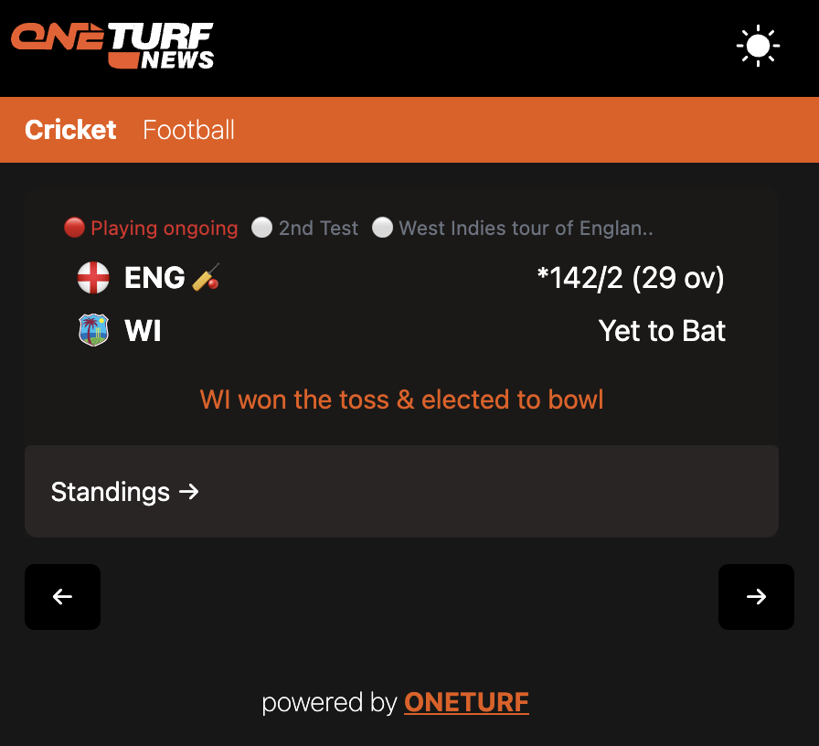

# Flow

- The chrome extension is a Reactjs codebase
- The public folder contains a manifets.json which tells how to use the it
- On npm run build, we get dist folder, which will have also the manifest.json

- Go to chrome-> extensions
- Enable developer mode
- Click load unpacked, go to the codebase folder and choose the 'dist folder'
- That adds the extension to your browser
- Reference Resources: https://youtu.be/gtF2nHVjqFk?feature=shared&t=121

# View
- Light Mode: 

- Dark Mode:
